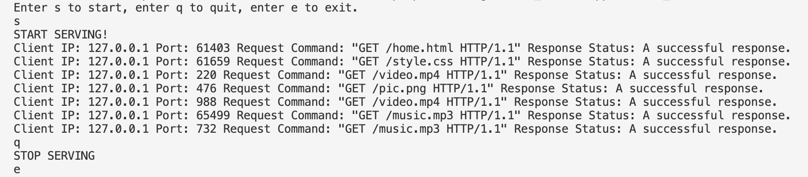

# MoeServer
A simple multithread processing web server with GUI based on **Linux**.

## V1.0 Command Line Mode

There is only one file in the command line mode version. You should change the config first.

```c
#define LISTEN_IP "0.0.0.0"
#define LISTEN_PORT 9000
#define ROOT_PATH "/home/wwwroot/workspace"
```

Then, you can use following command to get the executable file.

`g++ moeserver.cpp -o moeserver -lpthread -std=c++11`

Run the code:

`./moeserver`

Enter s to start, enter q to quit, enter e to exit. Just like this:

